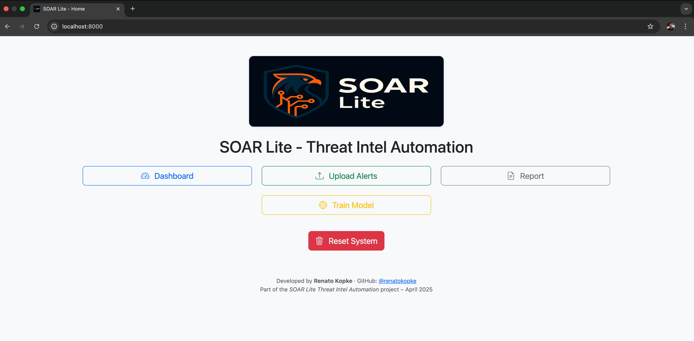
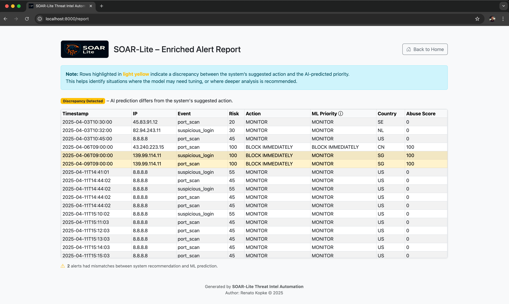

# SOAR-Lite Threat Intel Automation
<p align="center">
  
  
  
</p>

👉 [Watch the demo](https://www.youtube.com/watch?v=7DTvlmjtSO0) (2 min)

<p align="center">
  
</p>

A lightweight, modular, and real-time SOAR-Lite API designed to enrich security alerts with threat intelligence, calculate contextual risk scores, and recommend response actions (block, escalate, monitor). Ideal for SOC teams, security engineers, or incident responders looking to automate triage and reduce alert fatigue without the complexity or cost of full SOAR platforms.

## 🎯 Use Cases

- Automate SOC alert enrichment and prioritization
- Reduce alert fatigue with contextual risk scoring
- Rapid prototyping for threat hunting workflows
- Educational labs or security automation demos

---

<p align="center">
  <a href="https://www.youtube.com/watch?v=7DTvlmjtSO0" target="_blank">
    
  </a>
</p>

<p align="center">
  <strong>▶️ Click the image to watch the demo video</strong>
</p>

---
## 🔍 Features

- ✅ IP enrichment using [AbuseIPDB](https://www.abuseipdb.com) or mock data
- ✅ Risk scoring based on alert type and IP reputation
- ✅ Automated response suggestions (block, escalate, monitor)
- ✅ HTML report generation for visual review and auditing
- ✅ Real-time REST API
- ✅ Dockerized and easy to run locally or in the cloud
---

## ⚡ Quick Start (with Docker)

```bash
git clone https://github.com/renatokopke/SOAR-Lite-Threat-Intel-Automation.git
cd SOAR-Lite-Threat-Intel-Automation
cp .env.example .env
docker-compose up --build
```

### ⚙️ Configure .env

Edit the `.env` file:

```env
ABUSEIPDB_API_KEY='your_api_key_here'
DEBUG_MODE=true         # Set to false to use real API enrichment
```



### API Endpoints

### `GET /report`
- Displays an HTML report with all processed alerts
Open in your browser:
👉 http://localhost:8000/report

### `POST /process-alert`
- Upload a CSV file with alerts (timestamp, src_ip, dst_ip, event_type)
- Returns enriched alerts with risk score and action
```
curl -X POST "http://localhost:8000/process-alert" -F "file=@data/alerts.csv"
```

### 📊 Example Input (CSV)
```
timestamp,src_ip,dst_ip,event_type
2025-04-03T10:30:00,45.83.91.12,10.0.0.15,port_scan
2025-04-03T10:32:00,82.94.243.11,10.0.0.21,suspicious_login
```

## 👤 Author

**Renato Kopke**  
Cybersecurity • Incident Response • Threat Hunting • Automation Enthusiast

Feel free to connect on [LinkedIn](https://linkedin.com/in/renatokopke) if you’d like to collaborate, give feedback, or just say hi.

---

## 📖 License

Licensed under the [Apache License 2.0](./LICENSE)
