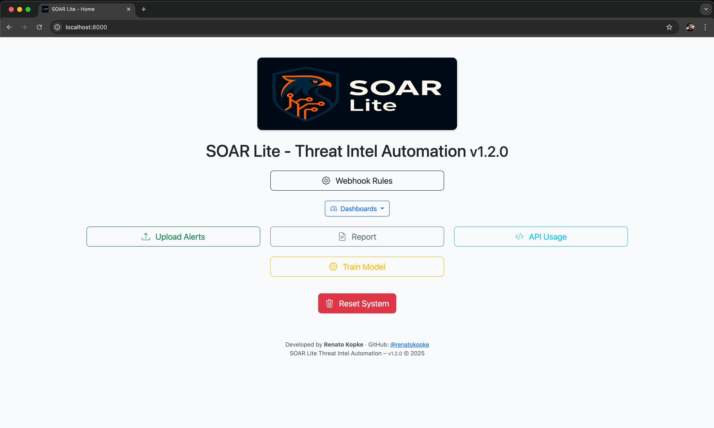
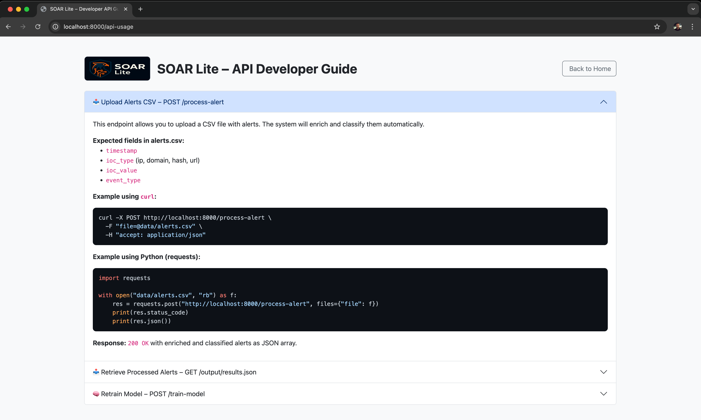

# SOAR Lite Threat Intel Automation

<p align="center">
  
  
  
  
  
</p>


👉 [Watch the demo](https://youtu.be/aH_EuDBAaaA) (2 min)

<p align="center">
  
</p>

<b>SOAR Lite</b> is a lightweight, modular, and real-time API for enriching security alerts using threat intelligence, contextual scoring, and machine learning. It helps SOC teams and security professionals automate alert triage, reduce noise, and make faster decisions — all without the overhead of traditional SOAR platforms.

## 🎯 Use Cases

- Automate SOC alert enrichment and prioritization
- Reduce alert fatigue with contextual risk scoring
- Rapid prototyping for threat hunting workflows
- Educational labs or security automation demos
- Integration with internal SIEM pipelines  
- Enrichment backend for custom dashboards

---

<p align="center">
  <a href="https://youtu.be/aH_EuDBAaaA" target="_blank">
    
  </a>
</p>

<p align="center">
  <strong>▶️ Click the image to watch the demo video</strong>
</p>

---
## 🔍 Features

- ✅ Bulk IOC Upload (CSV)
  - Quick upload and processing of multiple IOCs (IPs, domains, hashes) via CSV file.
- ✅ Threat Intelligence Enrichment
  - Automated enrichment using sources like AbuseIPDB and VirusTotal, with smart fallback support.
- ✅ ML-Based Alert Classification
  - Alert classification using Machine Learning (RandomForest) based on enriched data and metadata.
- ✅ Risk Scoring Engine
  - Combines heuristic rules and ML predictions to generate a risk score for each alert.
- ✅ Model Versioning & Metrics Dashboard
  - Tracks all trained models and displays performance metrics directly on the dashboard.
- ✅ Duplicate IOC Detection (seen_before)
  - Automatically detects and flags IOCs that were already seen in previous analyses.
- ✅ Visual HTML Reports
  - Generates detailed and user-friendly HTML reports highlighting key results and discrepancies.
- ✅ RESTful API
  - Full API support to allow easy integration with SIEMs, SOAR tools, and internal scripts.
- ✅ Lightweight Web Interface (FastAPI + Bootstrap)
  - Responsive, modern interface built with FastAPI and Bootstrap for local or internal deployment.
- ✅ Modular & Extensible Architecture
  - Well-structured codebase allowing easy development of new enrichment modules and classifiers.
- ✅ IOC Type Parsing & Mapping
  - Automatic identification and handling of different IOC types (IP, domain, hash, etc.).
- ✅ Open Source & Community-Driven
  - Built to be forked, customized, and enhanced by the community – perfect for internal SOC tools or educational use.
- ✅ Fully Dockerized
  - Easy deployment and sandbox testing via Docker Compose

---

## ⚡ Quick Start (with Docker)

```bash
git clone https://github.com/renatokopke/SOAR-Lite-Threat-Intel-Automation.git
cd SOAR-Lite-Threat-Intel-Automation
cp env-prod .env
docker-compose up --build
```

### ⚙️ Configure .env

Edit the `.env` file:

```env
ABUSEIPDB_API_KEY='abuseipdb_key_here'
VT_API_KEY='virustotal_key_here'

# Debug Mode
DEBUG_MODE=true

# Actions based on risk thresholds
# Minimum score for HIGH risk classification
HIGH_RISK_THRESHOLD=85

# Minimum score for MEDIUM risk classification
MEDIUM_RISK_THRESHOLD=60


# Slack Webhook URL used to send alerts from the system
#WEBHOOK_URL=https://hooks.slack.com/services/XXX/YYY/ZZZ

# Slack alert "View Full Report" button link
REPORT_URL=http://localhost:8000/report
```

---
## API Endpoints




### 📥 CSV Format – IOC Upload Template
```
📄 Required columns

Column          Description
timestamp	ISO 8601 datetime of the event (e.g., 2025-04-14T10:30:00)
ioc_type	Type of IOC (ip, domain, hash, url)
ioc_value	The actual IOC value (e.g., 8.8.8.8, malicious.com, etc.)
event_type	The type of security event (e.g., port_scan, malware_traffic)
```

### 📊 Example CSV (alerts.csv)
```
timestamp,ioc_type,ioc_value,event_type
2025-04-14T08:30:00,ip,45.83.91.12,port_scan
2025-04-14T08:35:00,ip,82.94.243.11,suspicious_login
2025-04-14T08:40:00,domain,maliciousdomain.com,data_exfiltration
2025-04-14T08:45:00,hash,44d88612fea8a8f36de82e1278abb02f,malware_traffic
2025-04-14T08:50:00,url,http://phishing-site.com/index.html,suspicious_login
2025-04-14T08:55:00,ip,8.8.8.8,brute_force
2025-04-14T09:00:00,domain,login.fakebank.io,c2_traffic
2025-04-14T09:05:00,hash,d41d8cd98f00b204e9800998ecf8427e,malware_traffic
2025-04-14T09:10:00,ip,139.99.114.11,port_scan
2025-04-14T09:15:00,ip,43.240.223.15,suspicious_login
```

---
## 👤 Author

**Renato Kopke**
Cybersecurity • Incident Response • Threat Hunting • Automation Enthusiast

🌐 [renatokopke.com](https://renatokopke.com)  
🔗 [LinkedIn](https://linkedin.com/in/renatokopke)  
🐙 [GitHub](https://github.com/renatokopke)

Feel free to connect if you’d like to collaborate, give feedback, or just say hi.

---

## 📌 Changelog

For a detailed list of changes, improvements, and version history, check the [CHANGELOG.md](./CHANGELOG.md).

---
## 📖 License

Licensed under the [Apache License 2.0](./LICENSE)